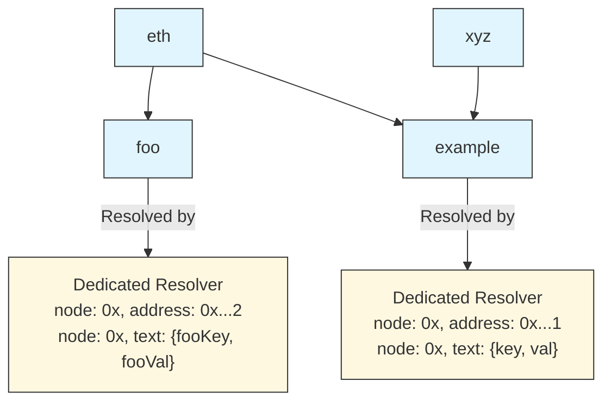

# ENSIP-16: Offchain Metadata and standardised name ownership events

## Abstract

This ENSIP specifies APIs for querying metadata directly on the resolver for EIP-3668 (CCIP Read: Secure offchain data retrieval) enabled names. EIP-3668 will power many of the domains in the future, however since the retrieval mechanism uses wildcard + offchain resolver, there is no standardised way to retrieve important metadata information such as the owner (who can change the records), or which L2/offchain database the records are stored on. This EIP also standardise registry and resolver events to support upcoming ENS v2's hierarchical registry model on NameChain while  provides a framework for supporting independent L2 subname issuing services through enhanced metadata discovery and registry traversal.

## Motivation

With EIP-3668 subdomains already starting to see wide adoption, it is important that there is a way for frontend interfaces to get important metadata to allow a smooth user experience. The original ENSIP-16 addressed basic offchain metadata discovery, but ENS v2 introduces a hierarchical model where each registry manages one name and issues subnames pointing to subregistries.

This EIP supports:

1. **Hierarchical Name Construction**: Events that allow traversal of registry hierarchies to construct full domain names, including an ability for a registry to be the subregistry of multiple parent registries to act as an alias (eg: both `example.eth`, and `example.xyz` uses the same registry with different parent registry)
2. **Cross-Chain Integration**: Support for independent L2 subname issuing services through enhanced metadata events
3. **Flexible Resolver Architecture**: Events supporting both hierarchical registry and dedicate resolvers as well as simplified contract that combines the registry and resolver altogether.
4. **Name Ejection and Migration**: Events for transferring names between L1 and L2 chains

## Specification

The following additional events are defined to support the ENS v2 hierarchical registry model:

### Events

##### Registry Events

```solidity
// Emitted when a new subname is registered
event NewSubname(bytes32 indexed labelhash, string label);

// Standard ERC1155 transfer event for name ownership changes
event TransferSingle(
    address indexed operator,
    address indexed from,
    address indexed to,
    uint256 id,
    uint256 value
);

// Standard ERC1155 transfer event for multiple name ownership changes
event TransferBatch(
  address indexed operator,
  address indexed from,
  address indexed to,
  uint256[] ids,
  uint256[] values
)

// Standard ERC721 transfer event for name ownership changes
event Transfer(
  address indexed from,
  address indexed to,
  uint256 tokenId,
)

// Emitted when subregistry is updated
event SubregistryUpdate(
    address indexed registry,
    uint256 indexed id,
    address subregistry
);

// Emitted when resolver is updated
event ResolverUpdate(
    address indexed registry,
    uint256 indexed id,
    address resolver
);
```

##### Resolver Events

To keep compatibility with ENS v1, resolver events maintain the same event interface as ENS v1 with one notable difference.

```solidity
// Emitted when address record changes in dedicated resolver
// Note: node is always 0x0000... for alias support
event AddressChanged(
    bytes32 indexed node,
    uint256 coinType,
    bytes newAddress
);

event AddrChanged(
  bytes32 indexed node,
  address a
);

event TextChanged(
    bytes32 indexed node,
    string indexed indexedKey,
    string key,
    string value
);

event ContenthashChanged(
  bytes32 indexed node,
  bytes hash
);
```

To cater for the alias feature enabled by the hirarchical registry model, node can be set as 0x, representing that the record is for any names that uses the resolver. 

The following diagram shows the relationship of each registry and its dedicated resolver.



ENS v2 contract does not restrict from subregistry to point to one of its ancestor in the hirarchy causing circular structure. When indexing, it should stop indexing if a circular dependency is detected.

#### Metadata Events

Metadata allows client to query offchain record via `graphqlUrl` endpoint.
If the data is stored on other EVM compatible chains, it can specify chain id and its root registry address so that indexers can dynamically discovere the new source and start indexing.

```solidity
// Enhanced version of original ENSIP-16 MetadataChanged event
// Emitted when L1 resolver metadata points to L2 chain
event MetadataChanged(
    bytes name,              // DNS-encoded name
    string graphqlUrl,       // GraphQL endpoint for L2 data
    uint256 chainId,         // L2 chain identifier
    address l2RegistryAddress // Root registry address on L2
);
```

### Event Usage Patterns

#### ENS v2 Hierarchical Name Construction

To construct full domain names in the hierarchical model:

1. Start from the root registry and traverse down through subregistries
2. Use `SubregistryUpdate` events to find child registries for each label
3. Query `NewSubname` events at each registry level to get label information
4. Build the complete name by concatenating labels as you traverse down the hierarchy
5. Resolve final records using `ResolverUpdate` and resolver-specific events
6. Resolvers use `node = 0x0000...` to set record 

#### Cross-Chain Name Resolution

For names pointing to L2 chains:

1. Name must first be ejected from L2 to L1 via `TransferSingle`, `TransferBatch`, `Transfer` event
2. L1 resolver emits enhanced `MetadataChanged` event with L2 chain information
3. Clients query the specified `graphqlUrl` for L2 name data
4. L2 registries may use either hierarchical or simplified models
5. When using simplified models, then specify node by namehashing the full name.

### GraphQL schema

[GraphQL](https://graphql.org) is a query language for APIs and a runtime for fulfilling those queries with onchain event data. You can use the hosted/decentralised indexing service such as [The Graph](https://thegraph.com), [Goldsky](https://docs.goldsky.com/introduction), [QuickNode](https://marketplace.quicknode.com/add-on/subgraph-hosting) or host your own using The Graph, or [ponder](https://ponder.sh)

#### L1 Schema 

```graphql
type Metadata {
  "l1 resolver address"
  id: ID!
  "DNS encoded name"
  name: String
  "url of the graphql endpoint"
  graphqlUrl: String
  "L2 chain identifier"
  chainId: BigInt
  "Root registry address on L2"
  l2RegistryAddress: Bytes
}
```

#### L2 Schema

```graphql
type Domain {
  id: ID!
  name: String
  namehash: Bytes
  labelName: String
  labelhash: Bytes
  resolvedAddress: Bytes
  subdomains: [Domain!]!
  subdomainCount: Int!
  resolver: Resolver!
  expiryDate: BigInt
  "The account that owns the domain"
  owner: Account!
  # ENS v2 hierarchical registry extensions
  registry: Registry!
  # Enhanced cross-chain metadata
  chainId: BigInt
  l2RegistryAddress: Bytes
  graphqlUrl: String
}

type Registry {
  id: ID!
  domains: [Domain!]!
  subregistryUpdates: [SubregistryUpdate!]!
  resolverUpdates: [ResolverUpdate!]!
}

type Resolver {
  id: ID!
  node: Bytes
  address: Bytes
  domain: Domain
  addr: Bytes
  contentHash: Bytes
  texts: [String!]
  coinTypes: [BigInt!]
}

type Account @entity {
  "The unique identifier for the account"
  id: ID!
  "The domains owned by the account"
  domains: [Domain!]! @derivedFrom(field: "owner")
}
```

## Copyright

Copyright and related rights waived via [CC0](https://creativecommons.org/publicdomain/zero/1.0/).
