# ENSIP-X: L2 Registry and Resolver Events for Cross-Chain Name Services

## Abstract

This ENSIP specifies standardized registry and resolver events for L2 and cross-chain name services that build upon ENSIP-16's metadata discovery mechanism. It defines events that support ENS v2's hierarchical registry model on NameChain and provides a framework for independent L2 subname issuing services through enhanced event-based indexing.

## Motivation

As ENS expands to L2 chains and adopts a hierarchical registry model, there is a need for standardized events that allow indexers to track name ownership, registry relationships, and resolver updates across chains. This ENSIP works in conjunction with ENSIP-16, which provides the discovery mechanism via the MetadataChanged event, to create a complete cross-chain name service infrastructure.

## Specification

### Events

#### Registry Events

```solidity
// Emitted when a new subname is registered
event NewSubname(bytes32 indexed labelhash, string label);

// Standard ERC1155 transfer event for name ownership changes
event TransferSingle(
    address indexed operator,
    address indexed from,
    address indexed to,
    uint256 id,
    uint256 value
);

// Standard ERC1155 transfer event for multiple name ownership changes
event TransferBatch(
  address indexed operator,
  address indexed from,
  address indexed to,
  uint256[] ids,
  uint256[] values
)

// Standard ERC721 transfer event for name ownership changes
event Transfer(
  address indexed from,
  address indexed to,
  uint256 tokenId,
)

// Emitted when subregistry is updated
event SubregistryUpdate(
    address indexed registry,
    uint256 indexed id,
    address subregistry
);

// Emitted when resolver is updated
event ResolverUpdate(
    address indexed registry,
    uint256 indexed id,
    address resolver
);
```

NOTE: The registry contract supports either ERC721 (Transfer) or ERC1155 (TransferSingle, TransferBatch)

#### Resolver Events

To keep compatibility with ENS v1, resolver events maintain the same event interface as ENS v1 with one notable difference.

```solidity
// Emitted when address record changes in dedicated resolver
// Note: node is always 0x0000... for alias support
event AddressChanged(
    bytes32 indexed node,
    uint256 coinType,
    bytes newAddress
);

event AddrChanged(
  bytes32 indexed node,
  address a
);

event TextChanged(
    bytes32 indexed node,
    string indexed indexedKey,
    string key,
    string value
);

event ContenthashChanged(
  bytes32 indexed node,
  bytes hash
);
```

To cater for the alias feature enabled by the hierarchical registry model, node can be set as 0x, representing that the record is for any names that uses the resolver. 

The following diagram shows the relationship of each registry and its dedicated resolver.

```mermaid
graph TD
    %% Registry hierarchy
    eth["🏛️ ETH Registry<br/>Contract: 0xabc...123<br/>Manages: .eth TLD"]
    xyz["🏛️ XYZ Registry<br/>Contract: 0xdef...456<br/>Manages: .xyz TLD"]
    foo["🏛️ FOO Registry<br/>Contract: 0x789...abc<br/>Manages: foo subdomain<br/>Parent: eth"]
    example["🏛️ EXAMPLE Registry<br/>Contract: 0x456...def<br/>Manages: example subdomain<br/>Parents: eth, xyz (ALIAS)"]
    
    %% Registry relationships
    eth -->|SubregistryUpdate| foo
    eth -->|SubregistryUpdate| example
    xyz -->|SubregistryUpdate| example

    %% Resolver relationships
    example -.->|ResolverUpdate| resolver_example["🔧 Dedicated Resolver<br/>Contract: 0x111...222<br/>node: 0x000...000 (alias mode)<br/>📍 address: 0xuser...1<br/>📝 text: description='shared resolver'"]
    foo -.->|ResolverUpdate| resolver_foo["🔧 Dedicated Resolver<br/>Contract: 0x333...444<br/>node: 0x000...000 (alias mode)<br/>📍 address: 0xuser...2<br/>📝 text: purpose='foo specific'"]

    %% Styling
    classDef registry fill:#e1f5fe,stroke:#01579b,stroke-width:2px,color:#000,text-wrap:nowrap;
    classDef resolver fill:#fff8e1,stroke:#e65100,stroke-width:2px,color:#000,text-wrap:nowrap;
    classDef example fill:#f3e5f5,stroke:#4a148c,stroke-width:2px,color:#000,text-wrap:nowrap;
    class eth,xyz,foo registry;
    class example example;
    class resolver_example,resolver_foo resolver;
```



ENS v2 contract does not restrict from subregistry to point to one of its ancestor in the hierarchy causing circular structure. When indexing, it should stop indexing if a circular dependency is detected.

### Event Usage Patterns

#### ENS v2 Hierarchical Name Construction

To construct full domain names in the hierarchical model:

1. Start from the root registry and traverse down through subregistries
2. Use `SubregistryUpdate` events to find child registries for each label
3. Query `NewSubname` events at each registry level to get label information
4. Build the complete name by concatenating labels as you traverse down the hierarchy
5. Resolve final records using `ResolverUpdate` and resolver-specific events
6. Resolvers use `node = 0x0000...` to set record 

#### Cross-Chain Name Resolution

For names pointing to L2 chains:

1. Name must first be ejected from L2 to L1 via `TransferSingle`, `TransferBatch`, `Transfer` event
2. L1 resolver emits `MetadataChanged` event (defined in ENSIP-16) with L2 chain information
3. Clients query the specified `graphqlUrl` for L2 name data
4. L2 registries may use either hierarchical or simplified models
5. When using simplified models, then specify node by namehashing the full name.

### GraphQL Schema

The following schema should be implemented by L2 indexers to provide a standard interface for querying name data:

```graphql
type Domain {
  id: ID!
  name: String
  namehash: Bytes
  labelName: String
  labelhash: Bytes
  resolvedAddress: Bytes
  subdomains: [Domain!]!
  subdomainCount: Int!
  resolver: Resolver!
  expiryDate: BigInt
  "The account that owns the domain"
  owner: Account!
  # ENS v2 hierarchical registry extensions
  registry: Registry!
  # Enhanced cross-chain metadata
  chainId: BigInt
  l2RegistryAddress: Bytes
  graphqlUrl: String
}

type Registry {
  id: ID!
  domains: [Domain!]!
  subregistryUpdates: [SubregistryUpdate!]!
  resolverUpdates: [ResolverUpdate!]!
}

type Resolver {
  id: ID!
  node: Bytes
  address: Bytes
  domain: Domain
  addr: Bytes
  contentHash: Bytes
  texts: [String!]
  coinTypes: [BigInt!]
}

type Account @entity {
  "The unique identifier for the account"
  id: ID!
  "The domains owned by the account"
  domains: [Domain!]! @derivedFrom(field: "owner")
}
```

## Copyright

Copyright and related rights waived via [CC0](https://creativecommons.org/publicdomain/zero/1.0/).